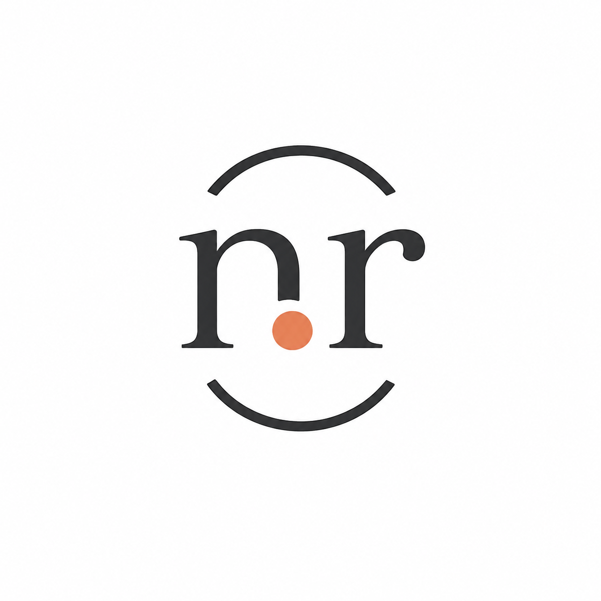

<p align="center">
  
</p>

<h1 align="center">Nicolas Del Rosario — Portfolio</h1>

<p align="center">
  A bilingual, static portfolio for software development work, experience, and writing.
</p>

<p align="center">
  <a href="https://nicolasdelrosario.com">Live site</a> ·
  <a href="https://github.com/nicolasdelrosario">GitHub</a> ·
  <a href="https://www.linkedin.com/in/nicolasdelrosario/">LinkedIn</a>
</p>

## Overview

This portfolio is built with Astro and presents the work, professional experience, and technical writing of Nicolas Del Rosario. Spanish is available at `/`; the English version lives at `/en/`.

## Stack

- Astro
- TypeScript
- CSS with shared design tokens
- Static generation with localized routes and sitemap support

## Requirements

- Node.js 26.5.0 or newer

If you use nvm:

```bash
nvm use
```

## Development

```bash
npm install
npm run dev
npm run build
```

## Project structure

| Path | Purpose |
| --- | --- |
| `src/pages/` | Localized pages and blog routes |
| `src/data/content.ts` | Shared copy and factual portfolio data |
| `src/components/` | Navigation, language switch, projects, and experience timeline |
| `src/styles/global.css` | Responsive layout and component styles |
| `tokens.css` | Colors, typography, spacing, and design tokens |
| `public/` | Favicon, brand assets, CVs, and static files |

The project uses Astro without a UI framework or additional runtime dependencies.
